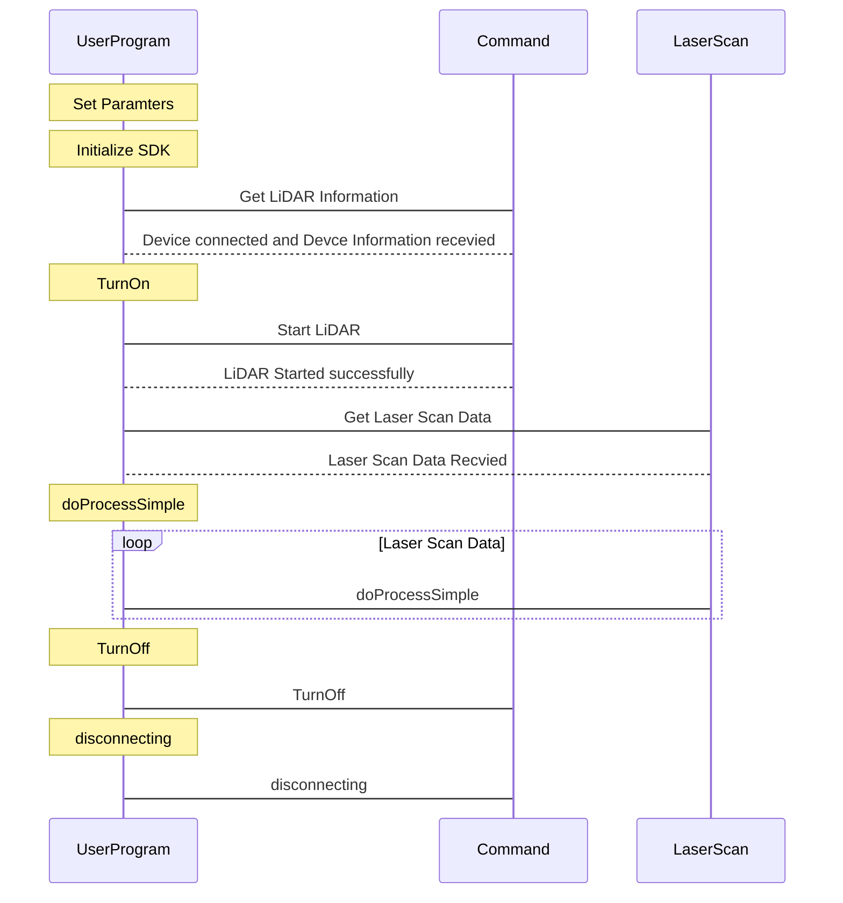

# FlowChart

```flow
st=>start: Start
op=>operation: Set Paramamters and Initialize
op1=>operation: TrunOn
tr=>operation: Try Again
op2=>operation: doProcessSimple
op3=>operation: TrunOff
op4=>operation: disconnecting
cond=>condition: success Yes or No?
cond1=>condition: success Yes or No?
cond2=>condition: success Yes or No?
cond3=>condition: LOOP Yes or No?
cond4=>condition: TryAgain Yes or No?
e=>end: End
en=>end: End

st(left)->op->cond
cond(yes)->op1->cond1
cond(no)->op3->op4->e
cond1(yes)->op2->cond3
cond3(yes)->op2
cond3(no, left)->op3->op4->e
cond1(no,right)->tr(bottom)->cond4
cond4(yes)->op3
cond4(no)->op3(right)->op4(right)->e
```

# sequenceDiagram


