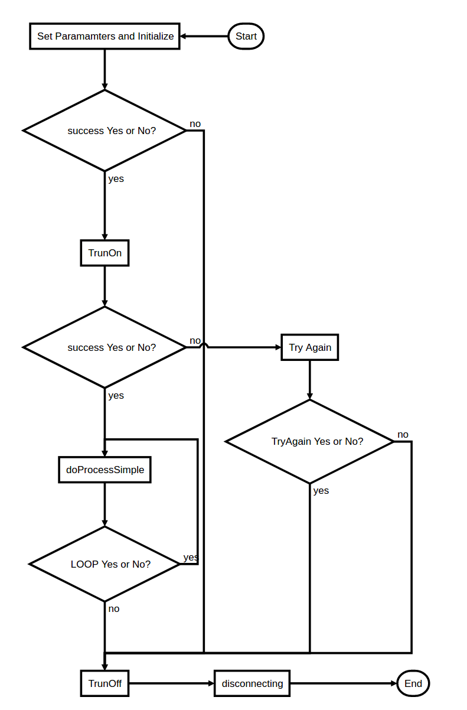
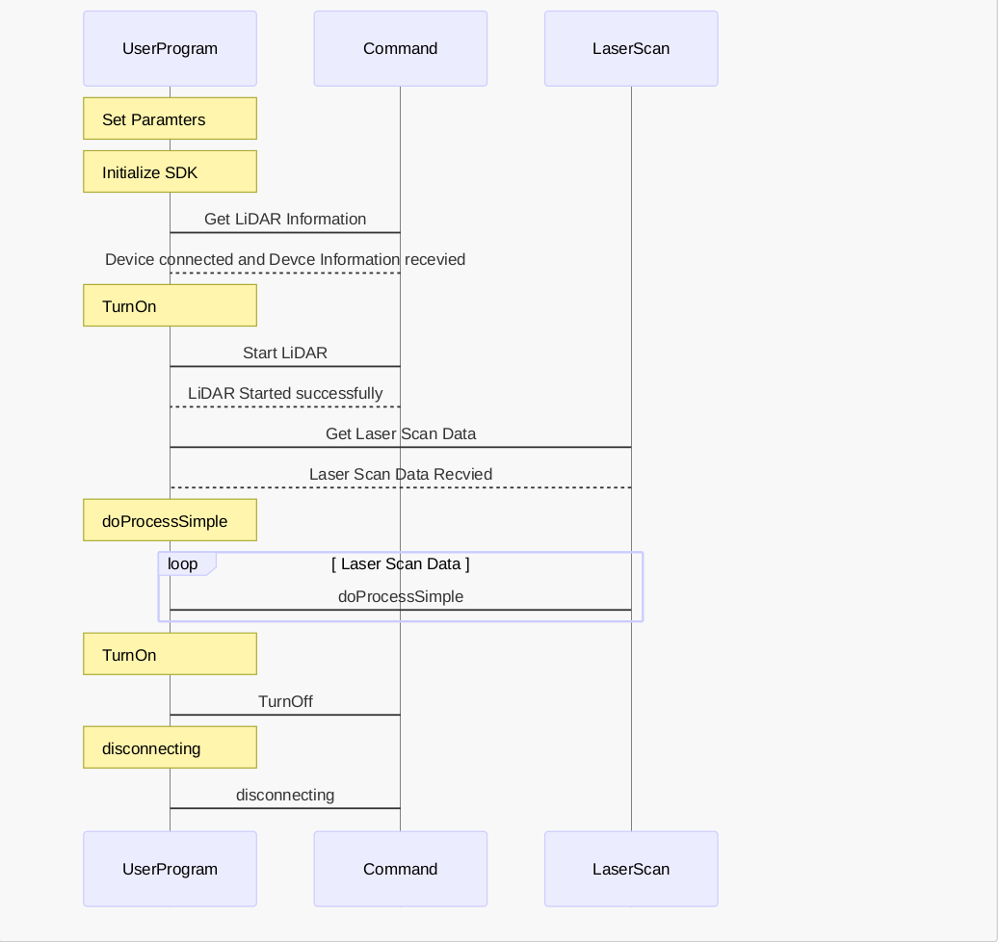

# YDLIDAR SDK API for Developers


This document provides an extensive technical deep dive into how to create, manipulate and use YDLIDAR SDK's API.

## Table of Contents

- [Samples](#samples)
    - [Create A System State](#create-a-system-state)
    - [Code Example](#code-example)
    - [Python Example](#python)
- [ThridParty Project Call Library OR Source](#thridparty-project-call-library-or-source)
    - [Introduction](#introduction)
    - [Calling a compliled library](#calling-a-compliled-library).
    - [Add source code to the Project](#add-source-code-to-the-project).
- [Development Flow](#development-flow)
- [C++ API Directory](#api-directory)
    - [CYdLidar](#cydlidar-api)
    - [YDlidarDriver](#ydlidardriver-api)
    - [ETLidarDriver](#etlidardriver-api)
    - [Parameter Table](#parameter-table)

## Samples

The first part of demonstrating YDLIDAR SDK API is to understand the ydlidar_test/tof_test/etlidar_Test example. Following are one optinal concepts:  `ydlidar::os_init()` (basic unit) of the example.

### Create A System State 

In the YDLIDAR SDK, the `ydlidar::os_init()` is optinal unit, If you need to accept `Ctrl + C` or other system abnormal signals. you can use it to create a system state, and check whether the system is normal by `ydlidar::os_isOk()`.
The system signal creation interface is as follows:

```C
ydlidar::os_init();
```

-  when `ydlidar::os_init()` has called, the system is in an initialized state, able to accept `Ctrl + C` and `ydlidar::os_shutdown()` signals.

### Code Example

#### Triangle LiDAR (../samples/ydlidar_test.cpp)

```C
#include "CYdLidar.h"
#include <iostream>
#include <string>
#include <algorithm>
#include <cctype>
using namespace std;
using namespace ydlidar;
#if defined(_MSC_VER)
#pragma comment(lib, "ydlidar_sdk.lib")
#endif

int main(int argc, char *argv[]) {
  // init system signal
  ydlidar::os_init();

  CYdLidar laser;
  //////////////////////string property/////////////////
  /// lidar port
  std::string port = "/dev/ydlidar
  laser.setlidaropt(LidarPropSerialPort, port.c_str(), port.size());
  /// ignore array
  std::string ignore_array;
  ignore_array.clear();
  laser.setlidaropt(LidarPropIgnoreArray, ignore_array.c_str(),
                    ignore_array.size());

  //////////////////////int property/////////////////
  /// lidar baudrate
  int optval = 230400;
  laser.setlidaropt(LidarPropSerialBaudrate, &optval, sizeof(int));
  /// tof lidar
  int optval = TYPE_TRIANGLE;
  laser.setlidaropt(LidarPropLidarType, &optval, sizeof(int));
  /// device type
  optval = YDLIDAR_TYPE_SERIAL;
  laser.setlidaropt(LidarPropDeviceType, &optval, sizeof(int));
  /// sample rate
  optval = 9;
  laser.setlidaropt(LidarPropSampleRate, &optval, sizeof(int));
  /// abnormal count
  optval = 4;
  laser.setlidaropt(LidarPropAbnormalCheckCount, &optval, sizeof(int));

  //////////////////////bool property/////////////////
  /// fixed angle resolution
  bool b_optvalue = false;
  laser.setlidaropt(LidarPropFixedResolution, &b_optvalue, sizeof(bool));
  /// rotate 180
  laser.setlidaropt(LidarPropReversion, &b_optvalue, sizeof(bool));
  /// Counterclockwise
  laser.setlidaropt(LidarPropInverted, &b_optvalue, sizeof(bool));
  b_optvalue = true;
  laser.setlidaropt(LidarPropAutoReconnect, &b_optvalue, sizeof(bool));
  /// one-way communication
  b_optvalue = false;
  laser.setlidaropt(LidarPropSingleChannel, &b_optvalue, sizeof(bool));
  /// intensity
  b_optvalue = false;
  laser.setlidaropt(LidarPropIntenstiy, &b_optvalue, sizeof(bool));
  /// Motor DTR
  b_optvalue = false;
  laser.setlidaropt(LidarPropSupportMotorDtrCtrl, &b_optvalue, sizeof(bool));

  //////////////////////float property/////////////////
  /// unit: °
  float f_optvalue = 180.0f;
  laser.setlidaropt(LidarPropMaxAngle, &f_optvalue, sizeof(float));
  f_optvalue = -180.0f;
  laser.setlidaropt(LidarPropMinAngle, &f_optvalue, sizeof(float));
  /// unit: m
  f_optvalue = 16.f;
  laser.setlidaropt(LidarPropMaxRange, &f_optvalue, sizeof(float));
  f_optvalue = 0.1f;
  laser.setlidaropt(LidarPropMinRange, &f_optvalue, sizeof(float));
  /// unit: Hz
  f_optvalue = 10.f;
  laser.setlidaropt(LidarPropScanFrequency, &f_optvalue, sizeof(float));

  // initialize SDK and LiDAR
  bool ret = laser.initialize();
  if (ret) {//success
    //Start the device scanning routine which runs on a separate thread and enable motor.
    ret = laser.turnOn();
  } else {
    fprintf(stderr, "%s\n", laser.DescribeError());
    fflush(stderr);
  }

  // Turn On success and loop  
  while (ret && ydlidar::os_isOk()) {
    LaserScan scan;
    if (laser.doProcessSimple(scan)) {
      fprintf(stdout, "Scan received[%llu]: %u ranges is [%f]Hz\n",
              scan.stamp,
              (unsigned int)scan.points.size(), 1.0 / scan.config.scan_time);
      fflush(stdout);
    } else {
      fprintf(stderr, "Failed to get Lidar Data\n");
      fflush(stderr);
    }
  }
  // Stop the device scanning thread and disable motor.
  laser.turnOff();
  // Uninitialize the SDK and Disconnect the LiDAR.
  laser.disconnecting();
  return 0;
}
```

#### TOF LiDAR (../samples/tof_test.cpp)

```C
#include "CYdLidar.h"
#include <iostream>
#include <string>
#include <algorithm>
#include <cctype>
using namespace std;
using namespace ydlidar;
#if defined(_MSC_VER)
#pragma comment(lib, "ydlidar_sdk.lib")
#endif

int main(int argc, char *argv[]) {
  // init system signal
  ydlidar::os_init();

  CYdLidar laser;
  //////////////////////string property/////////////////
  /// lidar port
  std::string port = "/dev/ydlidar
  laser.setlidaropt(LidarPropSerialPort, port.c_str(), port.size());
  /// ignore array
  std::string ignore_array;
  ignore_array.clear();
  laser.setlidaropt(LidarPropIgnoreArray, ignore_array.c_str(),
                    ignore_array.size());

  //////////////////////int property/////////////////
  /// lidar baudrate
  int optval = 512000;
  laser.setlidaropt(LidarPropSerialBaudrate, &optval, sizeof(int));
  /// tof lidar
  int optval = TYPE_TOF;
  laser.setlidaropt(LidarPropLidarType, &optval, sizeof(int));
  /// device type
  optval = YDLIDAR_TYPE_SERIAL;
  laser.setlidaropt(LidarPropDeviceType, &optval, sizeof(int));
  /// sample rate
  optval = 20;
  laser.setlidaropt(LidarPropSampleRate, &optval, sizeof(int));
  /// abnormal count
  optval = 4;
  laser.setlidaropt(LidarPropAbnormalCheckCount, &optval, sizeof(int));

  //////////////////////bool property/////////////////
  /// fixed angle resolution
  bool b_optvalue = false;
  laser.setlidaropt(LidarPropFixedResolution, &b_optvalue, sizeof(bool));
  /// rotate 180
  laser.setlidaropt(LidarPropReversion, &b_optvalue, sizeof(bool));
  /// Counterclockwise
  laser.setlidaropt(LidarPropInverted, &b_optvalue, sizeof(bool));
  b_optvalue = true;
  laser.setlidaropt(LidarPropAutoReconnect, &b_optvalue, sizeof(bool));
  /// one-way communication
  b_optvalue = false;
  laser.setlidaropt(LidarPropSingleChannel, &b_optvalue, sizeof(bool));
  /// intensity
  b_optvalue = false;
  laser.setlidaropt(LidarPropIntenstiy, &b_optvalue, sizeof(bool));
  /// Motor DTR
  b_optvalue = false;
  laser.setlidaropt(LidarPropSupportMotorDtrCtrl, &b_optvalue, sizeof(bool));

  //////////////////////float property/////////////////
  /// unit: °
  float f_optvalue = 180.0f;
  laser.setlidaropt(LidarPropMaxAngle, &f_optvalue, sizeof(float));
  f_optvalue = -180.0f;
  laser.setlidaropt(LidarPropMinAngle, &f_optvalue, sizeof(float));
  /// unit: m
  f_optvalue = 64.f;
  laser.setlidaropt(LidarPropMaxRange, &f_optvalue, sizeof(float));
  f_optvalue = 0.05f;
  laser.setlidaropt(LidarPropMinRange, &f_optvalue, sizeof(float));
  /// unit: Hz
  f_optvalue = 10.f;
  laser.setlidaropt(LidarPropScanFrequency, &f_optvalue, sizeof(float));

  // initialize SDK and LiDAR
  bool ret = laser.initialize();
  if (ret) {//success
    //Start the device scanning routine which runs on a separate thread and enable motor.
    ret = laser.turnOn();
  } else {
    fprintf(stderr, "%s\n", laser.DescribeError());
    fflush(stderr);
  }

  // Turn On success and loop  
  while (ret && ydlidar::os_isOk()) {
    LaserScan scan;
    if (laser.doProcessSimple(scan)) {
      fprintf(stdout, "Scan received[%llu]: %u ranges is [%f]Hz\n",
              scan.stamp,
              (unsigned int)scan.points.size(), 1.0 / scan.config.scan_time);
      fflush(stdout);
    } else {
      fprintf(stderr, "Failed to get Lidar Data\n");
      fflush(stderr);
    }
  }
  // Stop the device scanning thread and disable motor.
  laser.turnOff();
  // Uninitialize the SDK and Disconnect the LiDAR.
  laser.disconnecting();
  return 0;
}
```

#### CMake BUILD file(../samples/CMakeLists.txt)
```cmake
cmake_minimum_required(VERSION 2.8)
PROJECT(ydlidar_test)
set(CMAKE_CXX_FLAGS "${CMAKE_CXX_FLAGS} -std=c++11")
add_definitions(-std=c++11) # Use C++11

#Include directories
INCLUDE_DIRECTORIES(
     ${CMAKE_SOURCE_DIR}
     ${CMAKE_SOURCE_DIR}/../
     ${CMAKE_CURRENT_BINARY_DIR}
)

SET(EXECUTABLE_OUTPUT_PATH ${CMAKE_BINARY_DIR})

set(curdir ${CMAKE_CURRENT_SOURCE_DIR})
FILE(GLOB APP_LIST "${curdir}/*.cpp")
foreach(child ${APP_LIST})
  string(REPLACE "${curdir}/" "" app_main ${child})
  string(REPLACE ".cpp" "" APP_NAME ${app_main})
  ADD_EXECUTABLE(${APP_NAME} ${app_main})
  TARGET_LINK_LIBRARIES(${APP_NAME} ydlidar_sdk)
endforeach()
```
#### Build and Run
- Build: cd build & cmake ../ & make
- Run ydlidar_test or tof_test in terminals:
	- ./ydlidar_test
	- ./tof_test
- Examine the results: you should see message printing out in terminals.

### Python
```python
import os
import ydlidar
import time

if __name__ == "__main__":
    ydlidar.os_init();
    laser = ydlidar.CYdLidar();
    laser.setlidaropt(ydlidar.LidarPropSerialPort, "/dev/ydlidar");
    laser.setlidaropt(ydlidar.LidarPropSerialBaudrate, 230400);
    laser.setlidaropt(ydlidar.LidarPropLidarType, ydlidar.TYPE_TRIANGLE);
    laser.setlidaropt(ydlidar.LidarPropDeviceType, ydlidar.YDLIDAR_TYPE_SERIAL);
    laser.setlidaropt(ydlidar.LidarPropScanFrequency, 10.0);
    laser.setlidaropt(ydlidar.LidarPropSampleRate, 9);
    laser.setlidaropt(ydlidar.LidarPropSingleChannel, False);

    ret = laser.initialize();
    if ret:
        ret = laser.turnOn();
        scan = ydlidar.LaserScan();
        while ret and ydlidar.os_isOk() :
            r = laser.doProcessSimple(scan);
            if r:
                print("Scan received[",scan.stamp,"]:",scan.points.size(),"ranges is [",1.0/scan.config.scan_time,"]Hz");
            else :
                print("Failed to get Lidar Data")
            time.sleep(0.05);
        laser.turnOff();
    laser.disconnecting();

```

## ThridParty Project Call Library OR Source

### Introduction

There are two ways to integrate YDLIDAR SDK into your project.
* [Calling a compliled library](#calling-a-compliled-library).
    - [Download YDLIDAR SDK](#download-ydlidar-sdk)
    - [Build and Install](#build-and-install)
    - [Add YDLIDAR SDK to the CMakeLists file of your project](#add-ydlidar-sdk-to-the-cmakelists-file-of-your-project)
* [Add source code to the Project](#add-source-code-to-the-project).
    - [Copy YDLIDAR SDK to your project](#copy-ydlidar-sdk-to-your-project)
    - [Add YDLIDAR SDK project to the CMakeLists file of your project](#add-ydlidar-sdk-project-to-the-cmakelists-file-of-your-project)
  

### Calling a compliled library
The implementation of the demo mainly includes the following steps.

#### Download YDLIDAR SDK
```shell
$git clone https://github.com/YDLIDAR/YDLidar-SDK
```
#### Build and Install
```shell
$cd YDLidar-SDK/build
$cmake ../
$make
$sudo make install
```
Note:
* Default generate static library.
* If you want to generate YDLidar-SDK dynamic library, Add the following options when compiling:
```shell
$cmake -DBUILD_SHARED_LIBS=ON ../ && make
```

#### Add YDLIDAR SDK to the CMakeLists file of your project
```cmake
############## YDLIDAR SDK START#####################################
#find ydlidar_sdk package
find_package(ydlidar_sdk)
#Include directories
INCLUDE_DIRECTORIES(
  ${YDLIDAR_SDK_INCLUDE_DIRS}
)
#link library directories
link_directories(${YDLIDAR_SDK_LIBRARY_DIRS})

#Link your project to ydlidar_sdk library.
target_link_libraries(${PROJECT_NAME} ${YDLIDAR_SDK_LIBRARIES})

############## YDLIDAR SDK END#####################################
```

Detailed call Demo, see [here](https://github.com/YDLIDAR/ydlidar_tutorials)


### Add source code to the Project
The implementation of the demo mainly includes the following steps.

#### Copy YDLIDAR SDK to your project
```shell
$cd 'your project'
$git clone https://github.com/YDLIDAR/YDLidar-SDK
```
Note: The same can be downloaded and placed in your project directory.

#### Add YDLIDAR SDK project to the CMakeLists file of your project
```cmake
############## YDLIDAR SDK START#####################################
#Include directories
INCLUDE_DIRECTORIES(
  ${CMAKE_SOURCE_DIR}
  ${CMAKE_SOURCE_DIR}/YDLidar-SDK
  ${CMAKE_SOURCE_DIR}/YDLidar-SDK/src
  ${CMAKE_CURRENT_BINARY_DIR}/YDLidar-SDK
)
#Add YDLIDAR SDK sub project
add_subdirectory(YDLidar-SDK)

#Link your project to ydlidar_sdk library.
target_link_libraries(${PROJECT_NAME} ydlidar_sdk)

############## YDLIDAR SDK END#####################################
```
Note: 
* If you do not want to generate samples in YDLidar-SDK, Add the following options when compiling:
```shell
$cmake -DBUILD_EXAMPLES=OFF ../ && make
```
* If you want to generate YDLidar-SDK dynamic library, Add the following options when compiling:
```shell
$cmake -DBUILD_SHARED_LIBS=ON ../ && make
```
* If you want to meet both of the above conditions, the operation is as follows:
```shell
$cmake -DBUILD_EXAMPLES=OFF -DBUILD_SHARED_LIBS=ON ../ && make
```
Detailed call Demo, see [here](https://github.com/YDLIDAR/DemoProject/YDLidar-SDK-Source-Demo)

## Development Flow

### FlowChart


### Sequence


## API Directory

### CYDLidar API
For additional information and examples, refer to [CYDLidar](#cydlidar)

### API List

#### C++ API

```C++
/**
* @brief set lidar properties
* @param optname        option name
* @todo string properties
* - @ref LidarPropSerialPort
* - @ref LidarPropIgnoreArray
* @note set string property example
* @code
* CYdLidar laser;
* std::string lidar_port = "/dev/ydlidar";
* laser.setlidaropt(LidarPropSerialPort,lidar_port.c_str(), lidar_port.size());
* @endcode
* @todo int properties
* - @ref LidarPropSerialBaudrate
* - @ref LidarPropLidarType
* - @ref LidarPropDeviceType
* - @ref LidarPropSampleRate
* @note set int property example
* @code
* CYdLidar laser;
* int lidar_baudrate = 230400;
* laser.setlidaropt(LidarPropSerialPort,&lidar_baudrate, sizeof(int));
* @endcode
* @todo bool properties
* - @ref LidarPropFixedResolution
* - @ref LidarPropReversion
* - @ref LidarPropInverted
* - @ref LidarPropAutoReconnect
* - @ref LidarPropSingleChannel
* - @ref LidarPropIntenstiy
* - @ref LidarPropSupportMotorDtrCtrl
* - @ref LidarPropSupportHeartBeat
* @note set bool property example
* @code
* CYdLidar laser;
* bool lidar_fixedresolution = true;
* laser.setlidaropt(LidarPropSerialPort,&lidar_fixedresolution, sizeof(bool));
* @endcode
* @todo float properties
* - @ref LidarPropMaxRange
* - @ref LidarPropMinRange
* - @ref LidarPropMaxAngle
* - @ref LidarPropMinAngle
* - @ref LidarPropScanFrequency
* @note set float property example
* @code
* CYdLidar laser;
* float lidar_maxrange = 16.0f;
* laser.setlidaropt(LidarPropSerialPort,&lidar_maxrange, sizeof(float));
* @endcode
* @param optval         option value
* - std::string(or char*)
* - int
* - bool
* - float
* @param optlen         option length
* - data type size
* @return true if the Property is set successfully, otherwise false.
* @see LidarProperty
*/
bool setlidaropt(int optname, const void *optval, int optlen);

/**
* @brief get lidar property
* @param optname         option name
* @todo string properties
* - @ref LidarPropSerialPort
* - @ref LidarPropIgnoreArray
* @note get string property example
* @code
* CYdLidar laser;
* char lidar_port[30];
* laser.getlidaropt(LidarPropSerialPort,lidar_port, sizeof(lidar_port));
* @endcode
* @todo int properties
* - @ref LidarPropSerialBaudrate
* - @ref LidarPropLidarType
* - @ref LidarPropDeviceType
* - @ref LidarPropSampleRate
* @note get int property example
* @code
* CYdLidar laser;
* int lidar_baudrate;
* laser.getlidaropt(LidarPropSerialPort,&lidar_baudrate, sizeof(int));
* @endcode
* @todo bool properties
* - @ref LidarPropFixedResolution
* - @ref LidarPropReversion
* - @ref LidarPropInverted
* - @ref LidarPropAutoReconnect
* - @ref LidarPropSingleChannel
* - @ref LidarPropIntenstiy
* - @ref LidarPropSupportMotorDtrCtrl
* - @ref LidarPropSupportHeartBeat
* @note get bool property example
* @code
* CYdLidar laser;
* bool lidar_fixedresolution;
* laser.getlidaropt(LidarPropSerialPort,&lidar_fixedresolution, sizeof(bool));
* @endcode
* @todo float properties
* - @ref LidarPropMaxRange
* - @ref LidarPropMinRange
* - @ref LidarPropMaxAngle
* - @ref LidarPropMinAngle
* - @ref LidarPropScanFrequency
* @note set float property example
* @code
* CYdLidar laser;
* float lidar_maxrange;
* laser.getlidaropt(LidarPropSerialPort,&lidar_maxrange, sizeof(float));
* @endcode
* @param optval          option value
* - std::string(or char*)
* - int
* - bool
* - float
* @param optlen          option length
* - data type size
* @return true if the Property is get successfully, otherwise false.
* @see LidarProperty
*/
bool getlidaropt(int optname, void *optval, int optlen);
/**
 * @brief Initialize the SDK and LiDAR.
 * @return true if successfully initialized, otherwise false.
 */
bool initialize();

/**
* @brief Return LiDAR's version information in a numeric form.
* @param version Pointer to a version structure for returning the version information.
*/
void GetLidarVersion(LidarVersion &version);

/**
 * @brief Start the device scanning routine which runs on a separate thread and enable motor.
 * @return true if successfully started, otherwise false.
 */
bool  turnOn();
/**
 * @brief Get the LiDAR Scan Data. turnOn is successful before doProcessSimple scan data.
 * @param[out] outscan             LiDAR Scan Data
 * @param[out] hardwareError       hardware error status
 * @return true if successfully started, otherwise false.
 */
bool doProcessSimple(LaserScan &outscan, bool &hardwareError);
/**
 * @brief Stop the device scanning thread and disable motor.
 * @return true if successfully Stoped, otherwise false.
 */
bool  turnOff();
/**
 * @brief Uninitialize the SDK and Disconnect the LiDAR.
 */
void disconnecting();

/**
 * @brief Get the last error information of a (socket or serial)
 * @return a human-readable description of the given error information
 * or the last error information of a (socket or serial)
 */
const char *DescribeError() const;
```
#### C API
```C
/**
 * @brief create a Lidar instance
 * @note call ::lidarDestroy destroy
 * @return created instance
 */
YDLidar *lidarCreate(void);

/**
 * @brief Destroy Lidar instance by ::lidarCreate create
 * @param lidar     CYdLidar instance
 */
void lidarDestroy(YDLidar **lidar);

/**
 * @brief set lidar properties
 * @param lidar           a lidar instance
 * @param optname        option name
 * @todo string properties
 * - @ref LidarPropSerialPort
 * - @ref LidarPropIgnoreArray
 * @note set string property example
 * @code
 * CYdLidar laser;
 * std::string lidar_port = "/dev/ydlidar";
 * laser.setlidaropt(LidarPropSerialPort,lidar_port.c_str(), lidar_port.size());
 * @endcode
 * @todo int properties
 * - @ref LidarPropSerialBaudrate
 * - @ref LidarPropLidarType
 * - @ref LidarPropDeviceType
 * - @ref LidarPropSampleRate
 * @note set int property example
 * @code
 * CYdLidar laser;
 * int lidar_baudrate = 230400;
 * laser.setlidaropt(LidarPropSerialPort,&lidar_baudrate, sizeof(int));
 * @endcode
 * @todo bool properties
 * - @ref LidarPropFixedResolution
 * - @ref LidarPropReversion
 * - @ref LidarPropInverted
 * - @ref LidarPropAutoReconnect
 * - @ref LidarPropSingleChannel
 * - @ref LidarPropIntenstiy
 * - @ref LidarPropSupportMotorDtrCtrl
 * - @ref LidarPropSupportHeartBeat
 * @note set bool property example
 * @code
 * CYdLidar laser;
 * bool lidar_fixedresolution = true;
 * laser.setlidaropt(LidarPropSerialPort,&lidar_fixedresolution, sizeof(bool));
 * @endcode
 * @todo float properties
 * - @ref LidarPropMaxRange
 * - @ref LidarPropMinRange
 * - @ref LidarPropMaxAngle
 * - @ref LidarPropMinAngle
 * - @ref LidarPropScanFrequency
 * @note set float property example
 * @code
 * CYdLidar laser;
 * float lidar_maxrange = 16.0f;
 * laser.setlidaropt(LidarPropSerialPort,&lidar_maxrange, sizeof(float));
 * @endcode
 * @param optval         option value
 * - std::string(or char*)
 * - int
 * - bool
 * - float
 * @param optlen         option length
 * - data type size
 * @return true if the Property is set successfully, otherwise false.
 * @see LidarProperty
 */
bool setlidaropt(YDLidar *lidar, int optname, const void *optval, int optlen);

/**
 * @brief get lidar property
 * @param lidar           a lidar instance
 * @param optname         option name
 * @todo string properties
 * - @ref LidarPropSerialPort
 * - @ref LidarPropIgnoreArray
 * @note get string property example
 * @code
 * CYdLidar laser;
 * char lidar_port[30];
 * laser.getlidaropt(LidarPropSerialPort,lidar_port, sizeof(lidar_port));
 * @endcode
 * @todo int properties
 * - @ref LidarPropSerialBaudrate
 * - @ref LidarPropLidarType
 * - @ref LidarPropDeviceType
 * - @ref LidarPropSampleRate
 * @note get int property example
 * @code
 * CYdLidar laser;
 * int lidar_baudrate;
 * laser.getlidaropt(LidarPropSerialPort,&lidar_baudrate, sizeof(int));
 * @endcode
 * @todo bool properties
 * - @ref LidarPropFixedResolution
 * - @ref LidarPropReversion
 * - @ref LidarPropInverted
 * - @ref LidarPropAutoReconnect
 * - @ref LidarPropSingleChannel
 * - @ref LidarPropIntenstiy
 * - @ref LidarPropSupportMotorDtrCtrl
 * - @ref LidarPropSupportHeartBeat
 * @note get bool property example
 * @code
 * CYdLidar laser;
 * bool lidar_fixedresolution;
 * laser.getlidaropt(LidarPropSerialPort,&lidar_fixedresolution, sizeof(bool));
 * @endcode
 * @todo float properties
 * - @ref LidarPropMaxRange
 * - @ref LidarPropMinRange
 * - @ref LidarPropMaxAngle
 * - @ref LidarPropMinAngle
 * - @ref LidarPropScanFrequency
 * @note set float property example
 * @code
 * CYdLidar laser;
 * float lidar_maxrange;
 * laser.getlidaropt(LidarPropSerialPort,&lidar_maxrange, sizeof(float));
 * @endcode
 * @param optval          option value
 * - std::string(or char*)
 * - int
 * - bool
 * - float
 * @param optlen          option length
 * - data type size
 * @return true if the Property is get successfully, otherwise false.
 * @see LidarProperty
 */
bool getlidaropt(YDLidar *lidar, int optname, void *optval, int optlen);

/**
* Return SDK's version information in a numeric form.
* @param version Pointer to a version for returning the version information.
*/
void GetSdkVersion(char *version);

/**
 * Initialize the SDK.
 * @return true if successfully initialized, otherwise false.
 */
bool initialize(YDLidar *lidar);

/**
* @brief Return LiDAR's version information in a numeric form.
* @param version Pointer to a version structure for returning the version information.
*/
void GetLidarVersion(YDLidar *lidar, LidarVersion *version);

/**
 * Start the device scanning routine which runs on a separate thread.
 * @return true if successfully started, otherwise false.
 */
bool turnOn(YDLidar *lidar);

/**
 * @brief Get the LiDAR Scan Data. turnOn is successful before doProcessSimple scan data.
 * @param[in] lidar          LiDAR instance
 * @param[out] outscan       LiDAR Scan Data
 * @return true if successfully started, otherwise false.
 */
bool doProcessSimple(YDLidar *lidar, LaserFan *outscan);
/**
 * @brief Stop the device scanning thread and disable motor.
 * @return true if successfully Stoped, otherwise false.
 */
bool  turnOff(YDLidar *lidar);
/**
 * @brief Uninitialize the SDK and Disconnect the LiDAR.
 */
void disconnecting(YDLidar *lidar);

/**
 * @brief Get the last error information of a (socket or serial)
 * @return a human-readable description of the given error information
 * or the last error information of a (socket or serial)
 */
const char *DescribeError(YDLidar *lidar);

/**
 * @brief initialize system signals
 */
void os_init();
/**
 * @brief isOk
 * @return true if successfully initialize, otherwise false.
 */
bool os_isOk();
/**
 * @brief os_shutdown
 */
void os_shutdown();

/**
 * @brief get lidar serial port
 * @param ports serial port lists
 * @return valid port number
 */
int lidarPortList(LidarPort *ports);

```


## YDlidarDriver API
For additional information and examples, refer to [YDlidarDriver](../src/ydlidar_driver.h)

### API List

```C
  /**
   * @brief Connecting Lidar \n
   * After the connection if successful, you must use ::disconnect to close
   * @param[in] port_path    serial port
   * @param[in] baudrate    serial baudrate，YDLIDAR-SS：
   *     230400 G2-SS-1 R2-SS-1
   * @return connection status
   * @retval 0     success
   * @retval < 0   failed
   * @note After the connection if successful, you must use ::disconnect to close
   * @see function ::YDlidarDriver::disconnect ()
   */
  virtual result_t connect(const char *port_path, uint32_t baudrate);

  /**
   * @brief Returns a human-readable description of the given error code
   *  or the last error code of a socket or serial port
   * @param isTCP   TCP or UDP
   * @return error information
   */
  virtual const char *DescribeError(bool isTCP = true);


  /*!
  * @brief Disconnect the LiDAR.
  */
  virtual void disconnect();

  /**
  * @brief Get SDK Version \n
  * static function
  * @return Version
  */
  virtual std::string getSDKVersion();

  /**
   * @brief lidarPortList Get Lidar Port lists
   * @return online lidars
   */
  static std::map<std::string, std::string> lidarPortList();


  /**
   * @brief Is the Lidar in the scan \n
   * @return scanning status
   * @retval true     scanning
   * @retval false    non-scanning
   */
  virtual bool isscanning() const;

  /**
   * @brief Is it connected to the lidar \n
   * @return connection status
   * @retval true     connected
   * @retval false    Non-connected
   */
  virtual bool isconnected() const;

  /**
   * @brief Is there intensity \n
   * @param[in] isintensities    intentsity
   *   true	intensity
   *   false no intensity
   */
  virtual void setIntensities(const bool &isintensities);

  /**
   * @brief whether to support hot plug \n
   * @param[in] enable    hot plug :
   *   true	support
   *   false no support
   */
  virtual void setAutoReconnect(const bool &enable);

  /**
   * @brief get Health status \n
   * @return result status
   * @retval RESULT_OK       success
   * @retval RESULT_FAILE or RESULT_TIMEOUT   failed
   */
  virtual result_t getHealth(device_health &health,
                             uint32_t timeout = DEFAULT_TIMEOUT);

  /**
   * @brief get Device information \n
   * @param[in] info     Device information
   * @param[in] timeout  timeout
   * @return result status
   * @retval RESULT_OK       success
   * @retval RESULT_FAILE or RESULT_TIMEOUT   failed
   */
  virtual result_t getDeviceInfo(device_info &info,
                                 uint32_t timeout = DEFAULT_TIMEOUT);

  /**
   * @brief Turn on scanning \n
   * @param[in] force    Scan mode
   * @param[in] timeout  timeout
   * @return result status
   * @retval RESULT_OK       success
   * @retval RESULT_FAILE    failed
   * @note Just turn it on once
   */
  virtual result_t startScan(bool force = false,
                             uint32_t timeout = DEFAULT_TIMEOUT) ;

  /**
   * @brief turn off scanning \n
   * @return result status
   * @retval RESULT_OK       success
   * @retval RESULT_FAILE    failed
   */
  virtual result_t stop();


  /**
   * @brief Get a circle of laser data \n
   * @param[in] nodebuffer Laser data
   * @param[in] count      one circle of laser points
   * @param[in] timeout    timeout
   * @return return status
   * @retval RESULT_OK       success
   * @retval RESULT_FAILE    failed
   * @note Before starting, you must start the start the scan successfully with the ::startScan function
   */
  virtual result_t grabScanData(node_info *nodebuffer, size_t &count,
                                uint32_t timeout = DEFAULT_TIMEOUT) ;


  /**
   * @brief Normalized angle \n
   * Normalize the angel between 0 and 360
   * @param[in] nodebuffer Laser data
   * @param[in] count      one circle of laser points
   * @return return status
   * @retval RESULT_OK       success
   * @retval RESULT_FAILE    failed
   * @note Before the normalization, you must use the ::grabScanData function to get the laser data successfully.
   */
  result_t ascendScanData(node_info *nodebuffer, size_t count);

  /**
  * @brief reset lidar \n
  * @param[in] timeout      timeout
  * @return return status
  * @retval RESULT_OK       success
  * @retval RESULT_FAILE    failed
  * @note Non-scan state, perform currect operation.
  */
  result_t reset(uint32_t timeout = DEFAULT_TIMEOUT);

  /**
   * @brief start motor \n
   * @return return status
   * @retval RESULT_OK       success
   * @retval RESULT_FAILE    failed
   */
  result_t startMotor();

  /**
   * @brief stop motor \n
   * @return return status
   * @retval RESULT_OK       success
   * @retval RESULT_FAILE    failed
   */
  result_t stopMotor();

  /**
  * @brief Get lidar scan frequency \n
  * @param[in] frequency    scanning frequency
  * @param[in] timeout      timeout
  * @return return status
  * @retval RESULT_OK       success
  * @retval RESULT_FAILE    failed
  * @note Non-scan state, perform currect operation.
  */
  virtual  result_t getScanFrequency(scan_frequency &frequency,
                                     uint32_t timeout = DEFAULT_TIMEOUT);

  /**
   * @brief Increase the scanning frequency by 1.0 HZ \n
   * @param[in] frequency    scanning frequency
   * @param[in] timeout      timeout
   * @return return status
   * @retval RESULT_OK       success
   * @retval RESULT_FAILE    failed
   * @note Non-scan state, perform currect operation.
   */
  virtual result_t setScanFrequencyAdd(scan_frequency &frequency,
                                       uint32_t timeout = DEFAULT_TIMEOUT);

  /**
   * @brief Reduce the scanning frequency by 1.0 HZ \n
   * @param[in] frequency    scanning frequency
   * @param[in] timeout      timeout
   * @return return status
   * @retval RESULT_OK       success
   * @retval RESULT_FAILE    failed
   * @note Non-scan state, perform currect operation.
   */
  virtual result_t setScanFrequencyDis(scan_frequency &frequency,
                                       uint32_t timeout = DEFAULT_TIMEOUT);

  /**
   * @brief Increase the scanning frequency by 0.1 HZ \n
   * @param[in] frequency    scanning frequency
   * @param[in] timeout      timeout
   * @return return status
   * @retval RESULT_OK       success
   * @retval RESULT_FAILE    failed
   * @note Non-scan state, perform currect operation.
   */
  virtual result_t setScanFrequencyAddMic(scan_frequency &frequency,
                                          uint32_t timeout = DEFAULT_TIMEOUT);

  /**
   * @brief Reduce the scanning frequency by 0.1 HZ \n
   * @param[in] frequency    scanning frequency
   * @param[in] timeout      timeout
   * @return return status
   * @retval RESULT_OK       success
   * @retval RESULT_FAILE    failed
   * @note Non-scan state, perform currect operation.
   */
  virtual result_t setScanFrequencyDisMic(scan_frequency &frequency,
                                          uint32_t timeout = DEFAULT_TIMEOUT);

  /**
   * @brief Get lidar sampling frequency \n
   * @param[in] frequency    sampling frequency
   * @param[in] timeout      timeout
   * @return return status
   * @retval RESULT_OK       success
   * @retval RESULT_FAILE    failed
   * @note Non-scan state, perform currect operation.
   */
  virtual result_t getSamplingRate(sampling_rate &rate,
                                   uint32_t timeout = DEFAULT_TIMEOUT);

  /**
   * @brief Set the lidar sampling frequency \n
   * @param[in] rate    　　　sampling frequency
   * @param[in] timeout      timeout
   * @return return status
   * @retval RESULT_OK       success
   * @retval RESULT_FAILE    failed
   * @note Non-scan state, perform currect operation.
   */
  virtual result_t setSamplingRate(sampling_rate &rate,
                                   uint32_t timeout = DEFAULT_TIMEOUT);

  /**
   * @brief get lidar zero offset angle \n
   * @param[in] angle　　　   zero offset angle
   * @param[in] timeout      timeout
   * @return return status
   * @retval RESULT_OK       success
   * @retval RESULT_FAILE    failed
   * @note Non-scan state, perform currect operation.
   */
  virtual result_t getZeroOffsetAngle(offset_angle &angle,
                                      uint32_t timeout = DEFAULT_TIMEOUT);
```

## ETLidarDriver API
For additional information and examples, refer to [ETLidarDriver](../src/ETLidarDriver.h)

### API List

```C
  /**
   * @brief Connecting Lidar \n
   * After the connection if successful, you must use ::disconnect to close
   * @param[in] port_path    Ip Address
   * @param[in] baudrate     network port
   * @return connection status
   * @retval 0     success
   * @retval < 0   failed
   * @note After the connection if successful, you must use ::disconnect to close
   * @see function ::YDlidarDriver::disconnect ()
   */
  virtual result_t connect(const char *port_path, uint32_t baudrate = 8000);


  /**
   * @brief Returns a human-readable description of the given error code
   *  or the last error code of a socket
   * @param isTCP   TCP or UDP
   * @return error information
   */
  virtual const char *DescribeError(bool isTCP = true);

  /**
  * @brief Disconnect from ETLidar device.
  */
  virtual void disconnect();

  /**
  * @brief Get SDK Version
  * @return version
  */
  virtual std::string getSDKVersion();

  /**
   * @brief Is the Lidar in the scan \n
   * @return scanning status
   * @retval true     scanning
   * @retval false    non-scanning
   */
  virtual bool isscanning() const;

  /**
   * @brief Is it connected to the lidar \n
   * @return connection status
   * @retval true     connected
   * @retval false    Non-connected
   */
  virtual bool isconnected() const;

  /**
   * @brief Is there intensity \n
   * @param[in] isintensities    intentsity
   *   true	intensity
   *   false no intensity
   */
  virtual void setIntensities(const bool &isintensities);

  /**
   * @brief whether to support hot plug \n
   * @param[in] enable    hot plug :
   *   true	support
   *   false no support
   */
  virtual void setAutoReconnect(const bool &enable);

  /**
   * @brief get Health status \n
   * @return result status
   * @retval RESULT_OK       success
   * @retval RESULT_FAILE or RESULT_TIMEOUT   failed
   */
  virtual result_t getHealth(device_health &health,
                             uint32_t timeout = DEFAULT_TIMEOUT);

  /**
   * @brief get Device information \n
   * @param[in] info     Device information
   * @param[in] timeout  timeout
   * @return result status
   * @retval RESULT_OK       success
   * @retval RESULT_FAILE or RESULT_TIMEOUT   failed
   */
  virtual result_t getDeviceInfo(device_info &info,
                                 uint32_t timeout = DEFAULT_TIMEOUT);

  /**
   * @brief Turn on scanning \n
   * @param[in] force    Scan mode
   * @param[in] timeout  timeout
   * @return result status
   * @retval RESULT_OK       success
   * @retval RESULT_FAILE    failed
   * @note Just turn it on once
   */
  virtual result_t startScan(bool force = false,
                             uint32_t timeout = DEFAULT_TIMEOUT) ;

  /**
   * @brief turn off scanning \n
   * @return result status
   * @retval RESULT_OK       success
   * @retval RESULT_FAILE    failed
   */
  virtual result_t stop();


  /**
   * @brief Get a circle of laser data \n
   * @param[in] nodebuffer Laser data
   * @param[in] count      one circle of laser points
   * @param[in] timeout    timeout
   * @return return status
   * @retval RESULT_OK       success
   * @retval RESULT_FAILE    failed
   * @note Before starting, you must start the start the scan successfully with the ::startScan function
   */
  virtual result_t grabScanData(node_info *nodebuffer, size_t &count,
                                uint32_t timeout = DEFAULT_TIMEOUT) ;

  /**
   * @brief Get lidar scan frequency \n
   * @param[in] frequency    scanning frequency
   * @param[in] timeout      timeout
   * @return return status
   * @retval RESULT_OK       success
   * @retval RESULT_FAILE    failed
   * @note Non-scan state, perform currect operation.
   */
  virtual result_t getScanFrequency(scan_frequency &frequency,
                                    uint32_t timeout = DEFAULT_TIMEOUT);

  /**
   * @brief Increase the scanning frequency by 1.0 HZ \n
   * @param[in] frequency    scanning frequency
   * @param[in] timeout      timeout
   * @return return status
   * @retval RESULT_OK       success
   * @retval RESULT_FAILE    failed
   * @note Non-scan state, perform currect operation.
   */
  virtual result_t setScanFrequencyAdd(scan_frequency &frequency,
                                       uint32_t timeout = DEFAULT_TIMEOUT);

  /**
   * @brief Reduce the scanning frequency by 1.0 HZ \n
   * @param[in] frequency    scanning frequency
   * @param[in] timeout      timeout
   * @return return status
   * @retval RESULT_OK       success
   * @retval RESULT_FAILE    failed
   * @note Non-scan state, perform currect operation.
   */
  virtual result_t setScanFrequencyDis(scan_frequency &frequency,
                                       uint32_t timeout = DEFAULT_TIMEOUT);

  /**
   * @brief Increase the scanning frequency by 0.1 HZ \n
   * @param[in] frequency    scanning frequency
   * @param[in] timeout      timeout
   * @return return status
   * @retval RESULT_OK       success
   * @retval RESULT_FAILE    failed
   * @note Non-scan state, perform currect operation.
   */
  virtual result_t setScanFrequencyAddMic(scan_frequency &frequency,
                                          uint32_t timeout = DEFAULT_TIMEOUT);

  /**
   * @brief Reduce the scanning frequency by 0.1 HZ \n
   * @param[in] frequency    scanning frequency
   * @param[in] timeout      timeout
   * @return return status
   * @retval RESULT_OK       success
   * @retval RESULT_FAILE    failed
   * @note Non-scan state, perform currect operation.
   */
  virtual result_t setScanFrequencyDisMic(scan_frequency &frequency,
                                          uint32_t timeout = DEFAULT_TIMEOUT);

  /**
   * @brief Get lidar sampling frequency \n
   * @param[in] frequency    sampling frequency
   * @param[in] timeout      timeout
   * @return return status
   * @retval RESULT_OK       success
   * @retval RESULT_FAILE    failed
   * @note Non-scan state, perform currect operation.
   */
  virtual result_t getSamplingRate(sampling_rate &rate,
                                   uint32_t timeout = DEFAULT_TIMEOUT);

  /**
   * @brief Set the lidar sampling frequency \n
   * @param[in] rate    　　　sampling frequency
   * @param[in] timeout      timeout
   * @return return status
   * @retval RESULT_OK       success
   * @retval RESULT_FAILE    failed
   * @note Non-scan state, perform currect operation.
   */
  virtual result_t setSamplingRate(sampling_rate &rate,
                                   uint32_t timeout = DEFAULT_TIMEOUT);
  /**
   * @brief get lidar zero offset angle \n
   * @param[in] angle　　　   zero offset angle
   * @param[in] timeout      timeout
   * @return return status
   * @retval RESULT_OK       success
   * @retval RESULT_FAILE    failed
   * @note Non-scan state, perform currect operation.
   */
  virtual result_t getZeroOffsetAngle(offset_angle &angle,
                                      uint32_t timeout = DEFAULT_TIMEOUT);


  /**
  * @brief Get current scan configuration.
  * @returns scanCfg structure.
  */
  bool getScanCfg(lidarConfig &config, const std::string &ip_address = "");

  /**
  * @brief Get current scan update configuration.
  * @returns scanCfg structure.
  */
  lidarConfig getFinishedScanCfg();

  /**
   * @brief updateScanCfg
   * @param config
   */
  void updateScanCfg(const lidarConfig &config);
```

## Parameter Table

The Table that the user uses to perform parameter related operations:

- Set the parameter related API by table.

For additional information and examples, refer to [Parameter](#code-example)

### Table List - Models
|LIDAR      | Model  |  Baudrate |  SampleRate(K) | Range(m)  		   |  Frequency(HZ) | Intenstiy(bit) | SingleChannel | voltage(V)|
| :-------- |:--:|:--:|:--:|:--:|:--:|:--:|:--:|:--:|
| F4        | 1	   |  115200   |   4            |  0.12~12         | 5~12           | false          | false    	  | 4.8~5.2   |
| S4        | 4	   |  115200   |   4            |  0.10~8.0        | 5~12 (PWM)     | false          | false    	  | 4.8~5.2   |
| S4B       | 4/11   |  153600   |   4            |  0.10~8.0        | 5~12(PWM)      | true(8)        | false    	  | 4.8~5.2   |
| S2        | 4/12   |  115200   |   3            |  0.10~8.0     	| 4~8(PWM)       | false          | true    		  | 4.8~5.2   |
| G4        | 5	   |  230400   |   9/8/4        |  0.28/0.26/0.1~16| 5~12        	  | false          | false    	  | 4.8~5.2   |
| X4        | 6	   |  128000   |   5            |  0.12~10     		| 5~12(PWM)      | false          | false    	  | 4.8~5.2   |
| X2/X2L    | 6	   |  115200   |   3            |  0.10~8.0     	| 4~8(PWM)       | false          | true    		  | 4.8~5.2   |
| G4PRO     | 7	   |  230400   |   9/8/4        |  0.28/0.26/0.1~16| 5~12        	  | false          | false    	  | 4.8~5.2   |
| F4PRO     | 8	   |  230400   |   4/6          |  0.12~12         | 5~12        	  | false          | false    	  | 4.8~5.2   |
| R2        | 9	   |  230400   |   5            |  0.12~16     		| 5~12        	  | false          | false    	  | 4.8~5.2   |
| G6        | 13     |  512000   |   18/16/8      |  0.28/0.26/0.1~25| 5~12        	  | false          | false    	  | 4.8~5.2   |
| G2A       | 14	   |  230400   |   5            |  0.12~12         | 5~12      	  | false          | false    	  | 4.8~5.2   |
| G2        | 15		|  230400   |   5            |  0.28~16     		| 5~12      	  | true(8)        | false    	  | 4.8~5.2   |
| G2C       | 16		|  115200   |   4            |  0.1~12        	| 5~12      	  | false      	 | false    	  | 4.8~5.2   |
| G4B       | 17		|  512000   |   10           |  0.12~16         | 5~12        	  | true(10)       | false    	  | 4.8~5.2   |
| G4C       | 18		|  115200   |   4            |  0.1~12		      | 5~12           | false          | false    	  | 4.8~5.2   |
| G1        | 19		|  230400   |   9            |  0.28~16         | 5~12      	  | false          | false    	  | 4.8~5.2   |
| TX8    　 | 100	   |  115200   |   4            |  0.1~8      	   | 4~8(PWM)       | false          | true      	  | 4.8~5.2   |
| TX20    　| 100	   |  115200   |   4            |  0.1~20      	   | 4~8(PWM)       | false          | true     	  | 4.8~5.2   |
| TG15    　| 100	   |  512000   |   20/18/10     |  0.05~30      	| 3~16      	  | false          | false    	  | 4.8~5.2   |
| TG30    　| 101	   |  512000   |   20/18/10     |  0.05~30      	| 3~16      	  | false          | false    	  | 4.8~5.2   |
| TG50    　| 102	   |  512000   |   20/18/10     |  0.05~50      	| 3~16      	  | false          | false    	  | 4.8~5.2   |
| T15    　 | 200	   |  8000     |   20           |  0.05~15      	| 10-35      	  | true           | false    	  | 4.8~5.2   |
| T30    　 | 200	   |  8000     |   20           |  0.05~30      	| 10-35      	  | true           | false    	  | 4.8~5.2   |


### Table List - SerialBaudrate
  <table>
       <tr><th>LiDAR                               <th>SerialBaudrate
       <tr><th>F4/S2/X2/X2L/S4/TX8/TX20/G4C        <td>115200
       <tr><th>X4                                  <td>128000
       <tr><th>S4B                                 <td>153600
       <tr><th>G1/G2/R2/G4/G4PRO/F4PRO             <td>230400
       <tr><th>G2A/G2C                             <td>230400
       <tr><th>G6/G4B/TG15/TG30/TG50               <td>512000
       <tr><th>T5/T15(network)                     <td>8000
   </table>


### Table List - SampleRate
   <table>
        <tr><th>LiDAR               <td>SampleRate
        <tr><th>G4/F4               <td>4,8,9
        <tr><th>F4PRO               <td>4,6
        <tr><th>G6                  <td>8,16,18
        <tr><th>G4B                 <td>10
        <tr><th>G1                  <td>9
        <tr><th>G2A/G2/R2/X4        <td>5
        <tr><th>S4/S4B/G4C/TX8/TX20 <td>4
        <tr><th>G2C                 <td>4
        <tr><th>S2                  <td>3
        <tr><th>TG15/TG30/TG50      <td>10,18,20
        <tr><th>T5/T15              <td>20
    </table>

### Table List - ScanFrequency
<table>
        <tr><th>LiDAR                           <td>ScanFrequency
        <tr><th>S2/X2/X2L/TX8/TX20              <td>4~8(PWM)
        <tr><th>F4/F4PRO/G4/G4PRO/R2            <td>5~12
        <tr><th>G6/G2A/G2/G2C/G4B/G4C/G1        <td>5~12
        <tr><th>S4/S4B/X4                       <td>5~12(PWM)
        <tr><th>TG15/TG30/TG50                  <td>3~16
        <tr><th>T5/T15                          <td>5~40
    </table>

### Table List - SingleChannel
<table>
        <tr><th>LiDAR                                 <th> SingleChannel
        <tr><th>G1/G2/G2A/G2C                          <td>false
        <tr><th>G4/G4B/G4PRO/G6/F4/F4PRO               <td>false
        <tr><th>S4/S4B/X4/R2/G4C                       <td>false
        <tr><th>S2/X2/X2L                              <td>true
        <tr><th>TG15/TG30/TG50                         <td>false
        <tr><th>TX8/TX20                               <td>true
        <tr><th>T5/T15                                 <td>false
        <tr><th>                                       <td>true
</table>

### Table List - LidarType
  <table>
       <tr><th>LiDAR                            <th> LidarType
       <tr><th>G1/G2A/G2/G2C                    <td>TYPE_TRIANGLE
       <tr><th>G4/G4B/G4C/G4PRO                 <td>TYPE_TRIANGLE
       <tr><th>G6/F4/F4PRO                      <td>TYPE_TRIANGLE
       <tr><th>S4/S4B/X4/R2/S2/X2/X2L           <td>TYPE_TRIANGLE
       <tr><th>TG15/TG30/TG50/TX8/TX20          <td>TYPE_TOF
       <tr><th>T5/T15                           <td>TYPE_TOF_NET
   </table>

### Table List - Intensity
   <table>
        <tr><th>LiDAR                                  <th> Intensity
        <tr><th>S4B/G2/G4B                             <td>true
        <tr><th>G4/G4C/G4PRO/F4/F4PRO/G6               <td>false
        <tr><th>G1/G2A/G2C/R2                          <td>false
        <tr><th>S2/X2/X2L/X4                           <td>false
        <tr><th>TG15/TG30/TG50                         <td>false
        <tr><th>TX8/TX20                               <td>false
        <tr><th>T5/T15                                 <td>true
        <tr><th>                                       <td>false
    </table>

### Table List - SupportMotorDtrCtrl
   <table>
        <tr><th>S4/S4B/S2/X2/X2L/X4                    <th>SupportMotorDtrCtrl
        <tr><th>S4/S4B/S2/X2/X2L/X4                    <td>true
        <tr><th>TX8/TX20                               <td>true
        <tr><th>G4/G4C/G4PRO/F4/F4PRO/G6               <td>false
        <tr><th>G1/G2A/G2C/R2/G2/G4B                   <td>false
        <tr><th>TG15/TG30/TG50                         <td>false
        <tr><th>T5/T15                                 <td>false
    </table>
