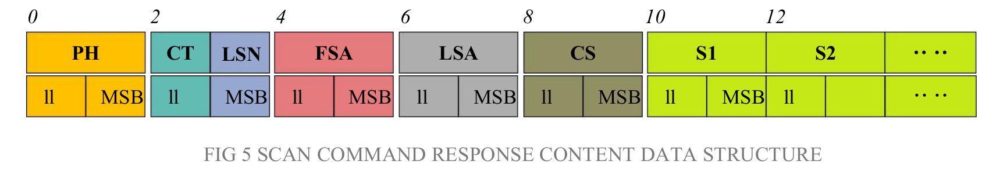

# YDLidar-SDK Communication Protocol
## Package Format
The response content is the point cloud data scanned by the system. According to the following data format, the data is sent to the external device in hexadecimal to the serial port.
No Intensity Byte Offset:


Intensity Byte Offset:


Scan data format output by LiDAR:
<table>
    <tr><th>Content       <th> Name              <th> Description
    <tr><th>PH(2B)        <td> Packet header      <td> 2 Byte in length, Fixed at 0x55AA, low is front, high in back.
    <tr><th>CT(1B)        <td> Package type       <td> Indicates the current packet type. (0x00 = CT & 0x01): Normal Point cloud packet. (0x01 = CT & 0x01): Zero packet.
    <tr><th>LSN(1B)       <td> Sample Data Number <td> Indicates the number of sampling points contained in the current packet. There is only once zero point of data in thre zero packet. the value is 1.
    <tr><th>FSA(2B)       <td> Starting angle     <td> The angle data corresponding to the first sample point in the smapled data.
    <tr><th>LSA(2B)       <td> End angle          <td> The angle data corresponding to the last sample point in the sampled data.
    <tr><th>CS(2B)        <td> Check code         <td> The check code of the current data packet uses a two-byte exclusive OR to check the current data packet.
    <tr><th>Si(2B/3B)     <td> Sampling data      <td> The system test sampling data is the distance data of the sampling point.

    Note: If the LiDAR has intensity, Si is 3 Byte. otherwise is 2 Byte.
    Si(3B)-->I(1B)(D(2B)): first Byte is Inentsity, The last two bytes are the Distance.
</table>

### Zero resolution
Start data packet: (CT & 0x01) = 0x01, LSN = 1, Si = 1.
scan frequency: When it was a zero packet, The Lidar Scan frequency: SF = (CT >> 1) / 10.f; The Calculated frequency is the Lidar real-time frequency of the previous frame.　If SF is non-zero, the protocol has real-time frequency.
For the analysis of the specific values of distance and angle, see the analysis of distance and angle.

### Distance analysis:
+ Distance solution formula:
    + Triangle LiDAR:
        ```
        Distance(i) = Si / 4;
        ```
    + TOF LiDAR:
        ```
        Distance(i) = Si;
        ```

Si is sampling data. Sampling data is set to E5 6F. Since the system is in the little-endian mode, the
sampling point S = 0x6FE5, and it is substituted into the distance solution formula, which yields

* Triangle LiDAR:
    ```
    Distance = 7161.25mm
    ```
* TOF LiDAR:
    ```
    Distance = 28645mm
    ```

### Intensity analysis:
Si(3B) split into three bytes : S(0) S(1) S(2)
+ Inensity solution formula:
    + Triangle LiDAR:
        ```
        Intensity(i) = uint16_t((S(1) & 0x03)<< 8 | S(0));
        Distance(i) = uint16_t(S(2) << 8 | S(1)) >> 2;
        ```

Si is sampling data. Sampling data is set to 1F E5 6F. Since the system is in the little-endian mode, the
* Triangle LiDAR:
    ```
    Intensity = uint16_t((0xE5 & 0x03)<< 8 | 0x1F) = 287;
    Distance = uint16_t(0x6F << 8 | 0xE5) >> 2 = 7161mm;
    ```
### Angle analysis:

#### First level analysis:
Starting angle solution formula:$$Angle_{FSA}=\frac{Rshiftbit(FSA, 1)}{64}$$
End angle solution formula:$$Angle_{LSA}=\frac{Rshiftbit(LSA, 1)}{64}$$
Intermediate angle solution formula:
$$Angle_{i}=\frac{diff(Angle)}{LSN - 1}*i + Angle_{FSA}  (0,1,\ldots,LSN-1)$$
$Angle_{0} : Angle_{FSA}$;
$Angle_{LSN-1} : Angle_{LSA}$;


`Rshiftbit(data,1)` means shifting the data to the right by one bit.diff Angle means the clockwise angle difference from the starting angle (uncorrected value) to the ending angle (uncorrected value),and LSN represents the number of packet samples in this frame.

`diff(Angle)`:　`(Angle(LSA) - Angle(FSA))` If less than zero, `diff(Angle) = (Angle(LSA)- Angle(FSA))  + 360`, otherwise `diff(Angle) = (Angle(LSA)- Angle(FSA))`

code
```
double Angle_FSA = (FSA >> 1) / 64;
double Angle_LSA = (LSA >> 1) / 64;
double angle_diff = Angle_LSA - Angle_FSA；
if(angle_diff < 0) {
    angle_diff += 360;
}
double Angle[LSN];
for(int i = 0; i < LSN; i++) {
    if(LSN > 1) {
        Angle[i] = i* angle_diff / (LSN - 1) + Angle_FSA;
    } else {
        Angle[i] = Angle_FSA;
    }
}

```

#### Second-level analysis:
Triangle Lidar only has current Second-level analysis, TOF Lidar does not need.

Angle correction formula: $Angle_{i} = Angle_{i} + AngCorrect_{i}$; ($1,2,\ldots,LSN$)
AngCorrect is the angle correction value, and its calculation formula is as follows, $tand^{-1}$ is an inverse trigonometric function. and the return angle value is:

if($Distance_{i}$ == 0) {
    $AngCorrect_{i}$ = 0;
} else {
    $AngCorrect_{i} = atan(21.8 * \frac{155.3 - Distance_{i}}{155.3*Distance_{i}}) * (180/3.1415926)$;
}

In the data packet, the 4th to 8th bytes are `28 E5 6F BD 79`, so `LSN = 0x28 = 40(dec)`, `FSA = 0x6FE5`, `LSA = 0x79BD`, and bring in the first-level solution formula, and get:
$Angle_{FSA} = 223.78^{°}$ 
$Angle_{LSA} = 243.47^{°}$ 
$diff(Angle) = Angle_{LSA} - Angle_{FSA} = 243.47^{°} - 223.78^{°} = 19.69^{°}$
$Angle_{i} = \frac{19.69^{°}}{39}*(i -1) + 223.78^{°}$  ($1,2,\ldots,LSN$)
Assume that in the frame data:
$Distance_{1} = 1000$
$Distance_{LSN} = 8000$
bring in the second-level solution formula, you get:
$AngCorrect_{1} = -6.7622^{°}$
$AngCorrect_{LSN} = -7.8374^{°}$
$Angle_{FSA} = Angle_{1} + AngCorrect_{1} = 217.0178^{°}$
$Angle_{LSA} = Angle_{LSA} + AngCorrect_{LSA} = 235.6326^{°}$
Similarly, $Angle_{i}(2,3, \ldots,LSN-1)$, can be obtained sequentially.

```
for(int i = 0; i < LSN; i++) {
    if(Distance[i] > 0) {
        double AngCorrect = atan(21.8 * (155.3 - Distance[i]) / (155.3 * Distance[i]));
        Angle[i] += AngCorrect * 180 / M_PI;//degree
    }
    if(Angle[i] >= 360) {
        Angle[i] -= 360;
    }   
}
```
Note:
* TOF LiDAR does not neeed second-level analysis.


### Check code parsing:
The check code uses a two-byte exclusive OR to verify the
current data packet. The check code itself does not participate in
XOR operations, and the XOR order is not strictly in byte order.
The XOR sequence is as shown in the figure. Therefore, the
check code solution formula is:

$$ CS = XOR \sum_{i=1}^{n}(C^i)$$

CS Sequence
<table>
    <tr><th>PH        <th> C(1)    
    <tr><th>FSA       <th> C(2)    
    <tr><th>S1        <th> C(3)    
    <tr><th>S2        <th> C(4)   
    <tr><th>...       <th> ..   
    <tr><th>Sn        <th> C(n-2)  
    <tr><th>[CT | LSN]  <th> C(n-1)   
    <tr><th>LSA       <th> C(n)   
</table>

* Note: XOR(end) indicates the XOR of the element from subscript 1 to end. However, XOR satisfies the exchange law, and the actual solution may not need to follow the XOR sequence.

### Code
No intensity Si(2B):
```
uint16_t checksumcal = PH;
checksumcal ^= FSA;
for(int i = 0; i < 2 * LSN; i = i +2 ) {
    checksumcal ^= uint16_t(data[i+1] <<8 | data[i]);
}
checksumcal ^= uint16_t(LSN << 8 | CT);
checksumcal ^= LSA;

## uint16_t : unsigned short 

```
Intensity Si(3B):
```
uint16_t checksumcal = PH;
checksumcal ^= FSA;
for(int i = 0; i < 3 * LSN; i = i + 3) {
    checksumcal ^= data[i];
    checksumcal ^= uint16_t(data[i+2] <<8 | data[i + 1]);
}
checksumcal ^= uint16_t(LSN << 8 | CT);
checksumcal ^= LSA;

## uint16_t : unsigned short 

```


### example
No Intensity:

<table>
    <tr><th>Name              <th> Size(Byte)       <th> Value               <th>  Contant                     <th> Buffer
    <tr><th rowspan="2" >PH   <td rowspan="2" > 2   <td rowspan="2"> 0x55AA  <td rowspan="2">  Header  	       <td> 0xAA <tr> <td> 0x55 
    <tr><th>CT                <td> 1                <td> 0x01              <td> Type  	                       <td> 0x01
    <tr><th>LSN               <td> 1                <td> 0x01              <td> Number  	                   <td> 0x01
    <tr><th rowspan="2" >FSA <td rowspan="2" > 2   <td rowspan="2"> 0xAE53  <td rowspan="2">  Starting Angle   <td> 0x53 <tr> <td> 0xAE
    <tr><th rowspan="2" >LSA <td rowspan="2" > 2   <td rowspan="2"> 0xAE53  <td rowspan="2">  End Andgle       <td> 0x53 <tr> <td> 0xAE
    <tr><th rowspan="2" >CS  <td rowspan="2" > 2   <td rowspan="2"> 0x54AB  <td rowspan="2">  Check code       <td> 0xAB <tr> <td> 0x54
    <tr><th rowspan="2" >S0  <td rowspan="2" > 2   <td rowspan="2"> 0x0000   <td rowspan="2">  0 index Distance <td> 0x00 <tr> <td> 0x00
</table>

```
uint8_t Buffer[12];
Buffer[0] = 0xAA;
Buffer[1] = 0x55;
Buffer[2] = 0x01;
Buffer[3] = 0x01;
Buffer[4] = 0x53;
Buffer[5] = 0xAE;
Buffer[6] = 0x53;
Buffer[7] = 0xAE;
Buffer[8] = 0xAB;
Buffer[9] = 0x54;
Buffer[10] = 0x00;
Buffer[11] = 0x00;

uint16_t check_code = 0x55AA;
uint8_t CT = Buffer[2] & 0x01;
uin8_t LSN = Buffer[3];
uint16_t FSA = uint16_t(Buffer[5] << 8 | Buffer[4]);
check_code ^= FSA;
uint16_t LSA = uint16_t(Buffer[7] << 8 | Buffer[6]);
uint16_t CS = uint16_t(Buffer[9] << 8 | Buffer[8]);

double Distance[LSN];
for(int i = 0; i < 2 * LSN; i = i + 2) {
    uint16_t data = uint16_t(Buffer[10 + i + 1] << 8 | Buffer[10 + i]);
    check_code ^= data;
    Distance[i / 2 ] = data / 4;
}
check_code ^= uint16_t(LSN << 8 | CT);
check_code ^= LSA;

double Angle[LSN];

if(check_code == CS) {
    double Angle_FSA = (FSA >> 1) / 64;
    double Angle_LSA = (LSA >> 1) / 64;
    double Angle_Diff = (Angle_LSA - Angle_FSA);
    if(Angle_Diff < 0) {
        Angle_Diff = Angle_Diff + 360;
    }
    for(int i = 0; i < LSN; i++) {
        if(LSN > 1) {
            Angle[i] = i * Angle_Diff/ (LSN- 1) + Angle_FSA;
        } else {
            Angle[i] = Angle_FSA;
        }
        if(Distance[i] > 0) {
            double AngCorrect = atan(21.8 * (155.3 - Distance[i]) / (155.3 * Distance[i]));
            Angle[i] = Angle[i] + AngCorrect * 180 / M_PI;
        }
        if(Angle[i] >= 360) {
            Angle[i] -= 360;
        }
    }
}
 
```

Intensity:

<table>
    <tr><th>Name              <th> Size(Byte)       <th> Value               <th>  Contant                     <th> Buffer
    <tr><th rowspan="2" >PH   <td rowspan="2" > 2   <td rowspan="2"> 0x55AA  <td rowspan="2">  Header  	       <td> 0xAA <tr> <td> 0x55 
    <tr><th>CT                <td> 1                <td> 0x01              <td> Type  	                       <td> 0x01
    <tr><th>LSN               <td> 1                <td> 0x01              <td> Number  	                   <td> 0x01
    <tr><th rowspan="2" >FSA <td rowspan="2" > 2   <td rowspan="2"> 0xAE53  <td rowspan="2">  Starting Angle   <td> 0x53 <tr> <td> 0xAE
    <tr><th rowspan="2" >LSA <td rowspan="2" > 2   <td rowspan="2"> 0xAE53  <td rowspan="2">  End Andgle       <td> 0x53 <tr> <td> 0xAE
    <tr><th rowspan="2" >CS  <td rowspan="2" > 2   <td rowspan="2"> 0x54AB  <td rowspan="2">  Check code       <td> 0xAB <tr> <td> 0x54
    <tr><th>I0               <td> 1                <td> 0x00                <td> 0 index Intensity  	       <td> 0x00
    <tr><th rowspan="2" >S0  <td rowspan="2" > 2   <td rowspan="2"> 0x0000   <td rowspan="2">  0 index Distance <td> 0x00 <tr> <td> 0x00
</table>


```
uint8_t Buffer[13];
Buffer[0] = 0xAA;
Buffer[1] = 0x55;
Buffer[2] = 0x01;
Buffer[3] = 0x01;
Buffer[4] = 0x53;
Buffer[5] = 0xAE;
Buffer[6] = 0x53;
Buffer[7] = 0xAE;
Buffer[8] = 0xAB;
Buffer[9] = 0x54;
Buffer[10] = 0x00;
Buffer[11] = 0x00;
Buffer[12] = 0x00;

uint16_t check_code = 0x55AA;
uint8_t CT = Buffer[2] & 0x01;
uin8_t LSN = Buffer[3];
uint16_t FSA = uint16_t(Buffer[5] << 8 | Buffer[4]);
check_code ^= FSA;
uint16_t LSA = uint16_t(Buffer[7] << 8 | Buffer[6]);
uint16_t CS = uint16_t(Buffer[9] << 8 | Buffer[8]);

double Distance[LSN];
uin16_t Itensity[LSN];
for(int i = 0; i < 3 * LSN; i = i + 3) {
    check_code ^= Buffer[10 + i];
    uint16_t data = uint16_t(Buffer[10 + i + 2] << 8 | Buffer[10 + i + 1]);
    check_code ^= data;
    Itensity[i / 3] = uint16_t((Buffer[10 + i + 1] & 0x03) <<8 |  Buffer[10 + i]);
    Distance[i / 3] = data >> 2;
}
check_code ^= uint16_t(LSN << 8 | CT);
check_code ^= LSA;

double Angle[LSN];

if(check_code == CS) {
    double Angle_FSA = (FSA >> 1) / 64;
    double Angle_LSA = (LSA >> 1) / 64;
    double Angle_Diff = (Angle_LSA - Angle_FSA);
    if(Angle_Diff < 0) {
        Angle_Diff = Angle_Diff + 360;
    }
    for(int i = 0; i < LSN; i++) {
        if(LSN > 1) {
            Angle[i] = i * Angle_Diff/ (LSN- 1) + Angle_FSA;
        } else {
            Angle[i] = Angle_FSA;
        }
        if(Distance[i] > 0) {
            double AngCorrect = atan(21.8 * (155.3 - Distance[i]) / (155.3 * Distance[i]));
            Angle[i] = Angle[i] + AngCorrect * 180 / M_PI;
        }
    }
}
 
```

For more details and usage examples, Refer to [Communication Protocol](https://github.com/YDLIDAR/ydlidar_tutorials/blob/master/CommunicationProtocol/README.md)