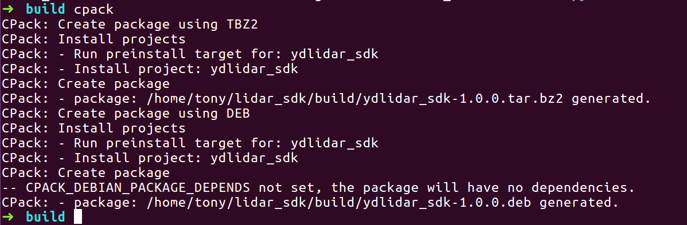
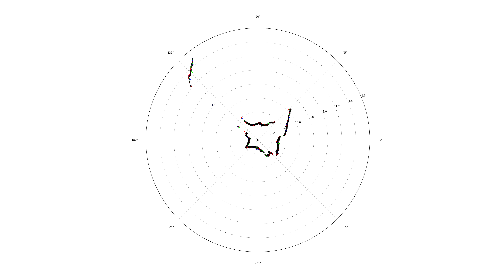

# How to Build and Install

* [1. Install CMake](#install-camke)
* [2. Build YDLidar-SDK](#build-ydlidar-sdk)
* [3. Run Samples](#run-ydlidar-sdk-sample)
* [4. Build in VSCode](#build-in-visual-studio-code)

## Install CMake
The installation procedures in Ubuntu 18.04/16.04/14.04 LTS and Windows 7/10 are shown here as examples. For Ubuntu 18.04/16.04/14.04 32-bit LTS and Mac, you can get it in [YDLidar-SDK wiki](https://github.com/YDLIDAR/YDLidar-SDK/wiki).
YDLidar SDK requires [CMake 2.8.2+](https://cmake.org/) as dependencies. 
### Ubuntu 18.04/16.04/14.04 LTS
You can install these packages using apt:
```shell
sudo apt install cmake pkg-config
```
if you want to use python API, you need to install python and swig(3.0 or higher):
```shell
sudo apt-get install python swig
sudo apt-get install python-pip
```
### Windows 7/10
[vcpkg](https://github.com/Microsoft/vcpkg) is recommended for building the dependency libraries as follows:
For the 32-bit project:
```
.\vcpkg install cmake
.\vcpkg integrate install
```
For the 64-bit project:
```
.\vcpkg install cmake:x64-windows
.\vcpkg integrate install
```
if you want to use python API, you need to install python and swig:
[python office install](https://wiki.python.org/moin/BeginnersGuide/Download)
[swig office install](http://www.swig.org/download.html)

## Build YDLidar-SDK
### Ubuntu 18.04/16.04/14.04 LTS
In the YDLidar SDK directory, run the following commands to compile the project:
```
git clone https://github.com/YDLIDAR/YDLidar-SDK.git
cd YDLidar-SDK
mkdir build
cd build
cmake ..
make
sudo make install
```
Note:
  If already installed python and swig, `sudo make install` command will also install python API without the following operations.

### python API install separtately:
The Next operation only installs the python API, if the above command has been executed, there is no need to perform the next operation.
```
cd YDLidar-SDK
pip install .

# Another method
python setup.py build
python setup.py install
```

### Windows 7/10
Then, in the YDLidar SDK directory, run the following commands to create the Visual Studio solution file. Please replace [vcpkgroot] with your vcpkg installation path.
Generate the 32-bit project:
```
cd build && \
cmake .. "-DCMAKE_TOOLCHAIN_FILE=[vcpkgroot]\scripts\buildsystems\vcpkg.cmake"
```
Generate the 64-bit project:
```
cd build && \
cmake .. -G "Visual Studio 15 2017 Win64" "-DCMAKE_TOOLCHAIN_FILE=[vcpkgroot]\scripts\buildsystems\vcpkg.cmake"
```
Note:
* For build C# API, set BUILD_CSHARP option to ON.
* You need to install [Swig](http://www.swig.org/download.html), When building C# API.
eg:
```
  cmake -DBUILD_CSHARP=ON .. -G "Visual Studio 15 2017 Win64" "-DCMAKE_TOOLCHAIN_FILE=[vcpkgroot]\scripts\buildsystems\vcpkg.cmake"
```

#### Compile YDLidar SDK
You can now compile the YDLidar SDK in Visual Studio.
Note: 
* For more windows build and Run, Please refer to [How to gerenrate Vs Project by CMake](how_to_gerenrate_vs_project_by_cmake.md)
* For VS2017 or higher, Please refer to [CMake projects in visual studio](https://docs.microsoft.com/zh-cn/cpp/build/cmake-projects-in-visual-studio?view=vs-2019)

### Packaging Project
```
cpack
```


## Run YDLidar SDK Sample
Three samples are provided in samples, which demonstrate how to configure YDLidar LiDAR units and receive the laser scan data when directly connecting YDLidar SDK to LiDAR units or by using a YDLidar Adapter board, respectively. The sequence diagram is shown as below:


### Ubuntu 18.04/16.04 /14.04 LTS
For Ubuntun 18.04/16.04/14.04 LTS, run the *tri_test* if connect with the Triangle LiDAR unit(s) or TOF LiDAR unit(s):
```
./tri_test
```
### Windows 7/10
After compiling the YDLidar SDK as shown in section 4.1.2, you can find `tri_test.exe` in the {YDLidar-SDK}\build\Debug or {YDLidar-SDK}\build\Release folder, respectively, which can be run directly.

Then you can see SDK initializing the information as below:


Then you can see SDK Scanning the information as below:


### Connect to the specific LiDAR units

Samples we provided will connect all the LiDAR device in you USB in default.There are two ways to connect the specific units:

* run sample with input options in serial port.

* run sample with input options in network.

#### Program Options

We provide the following program options for connecting the specific units :
```
[Please select the lidar baudrate:]: input LiDAR BaudRate.
[Whether the Lidar is one-way communication[yes/no]:]: Whether The Current LiDAR is single-channel.
[Please enter the lidar scan frequency[5-12]:]:input LiDAR Scan Frequency.
```

Here is the example:
```
__   ______  _     ___ ____    _    ____
\ \ / /  _ \| |   |_ _|  _ \  / \  |  _ \ 
 \ V /| | | | |    | || | | |/ _ \ | |_) | 
  | | | |_| | |___ | || |_| / ___ \|  _ <
  |_| |____/|_____|___|____/_/   \_\_| \_\ 

Baudrate:
0. 115200
1. 128000
2. 153600
3. 230400
4. 512000
Please select the lidar baudrate:4
Whether the Lidar is one-way communication[yes/no]:no
Please enter the lidar scan frequency[5-12]:10
```

### Python Run
```
cd python/examples
# Console
python tof_test.py
# If it's a drawing
pip install numpy
pip install matplotlib
python plot_tof_test.py
```



## Build in Visual Studio Code
### Install VSCode
The easiest way to install for Debian/Ubuntu based distributions is to download from  https://code.visualstudio.com and install the .deb package (64-bit) either through the graphical software center if it's available or through the command line with:
```bash
sudo dpkg -i <file>.deb
sudo apt-get install -f # Install dependencies
```
### Start VSCode
Start VSCode with the following command: 
```bash
code
```
### Open the YDLidar-SDK project in VSCode
Use the keyboard shortcut **(Ctrl+K Ctrl+O)** to open the YDLidar-SDK project. 
### Build the YDLidar-SDK project in VSCode
Use the keyboard shortcut **(Ctrl+Shift+B)** to build the YDLidar-SDK project. 
### Run all unit tests for the YDLidar-SDK project in VSCode
Select the "Tasks->Run Tasks..." menu command and click "run all unit tests for the YDLidar-SDK project" from a popup menu to check the code style for the YDLidar-SDK project. 

### Run a code style check task for the YDLidar-SDK project in VSCode
Select the "Tasks->Run Tasks..." menu command and click "code style check for the YDLidar-SDK project" from a popup menu to check the code style for the YDLidar-SDK project. 
### Clean the YDLidar-SDK project in VSCode
Select the "Tasks->Run Tasks..." menu command and click "clean the YDLidar-SDK project" from a popup menu to clean the YDLidar-SDK project. 
