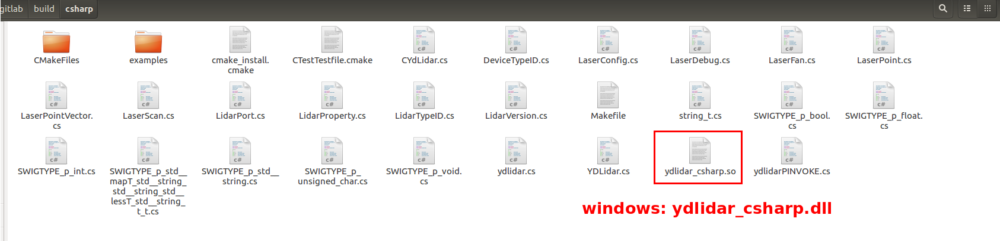
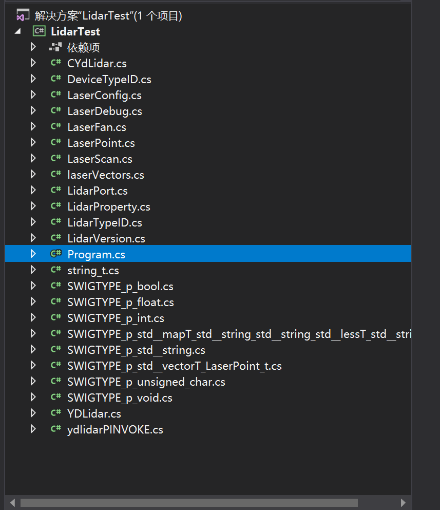
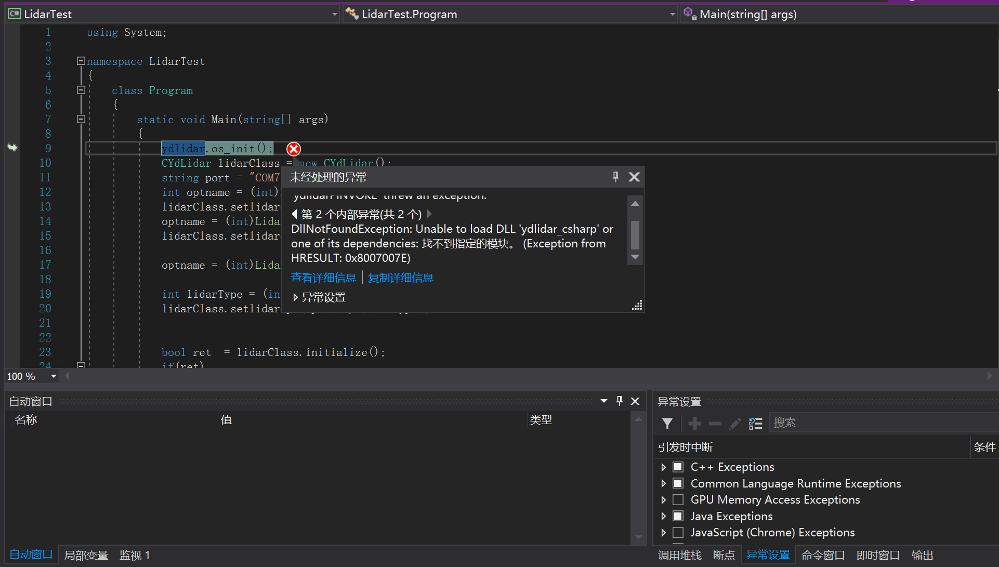
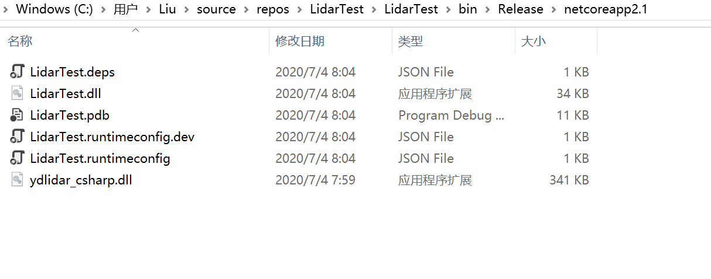
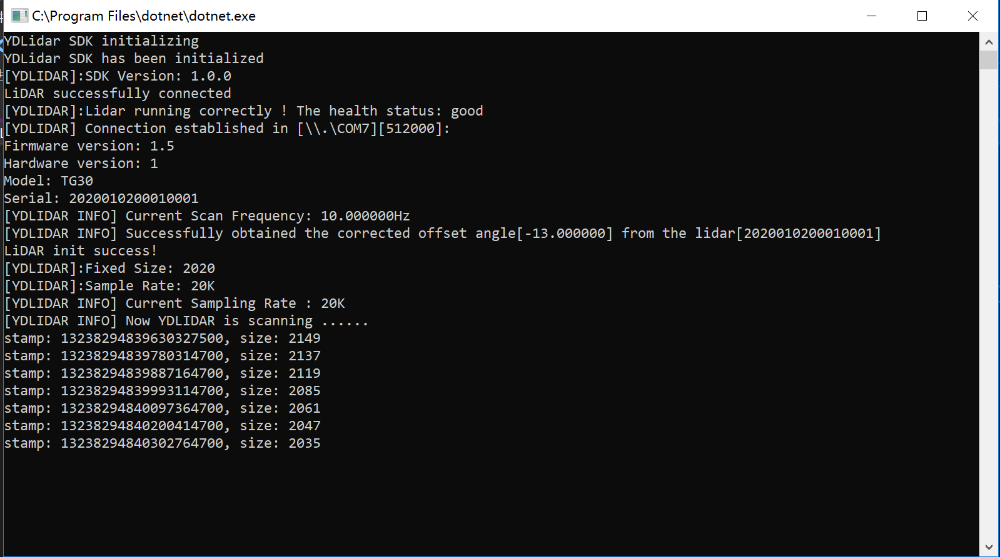

# How to create a csharp project

You can follow a sample setup:

- You need to install [Swig](http://www.swig.org/download.html).
- Set BUILD_CSHARP option to ON

```
  cmake -DBUILD_CSHARP=ON .. -G "Visual Studio 15 2017 Win64" "-DCMAKE_TOOLCHAIN_FILE=[vcpkgroot]\scripts\buildsystems\vcpkg.cmake"
```

- Compiling the SDK will generate the CSharp interface file and `ydlidar_csharp.dll` library




- Copy all `*.cs` files generated by the YDLidar-SDK to your project 




- If the following error occurs, you need to copy the compiled `ydlidar_csharp.dll` to the binary directory




- Copy `ydlidar_csharp.dll` to your project Binary directory




- Set up lidar test for TG30



