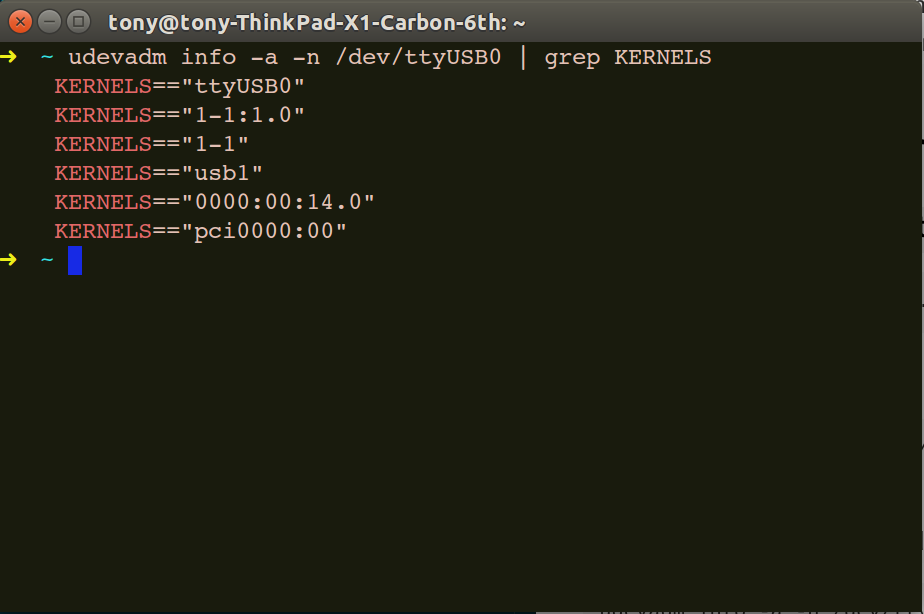
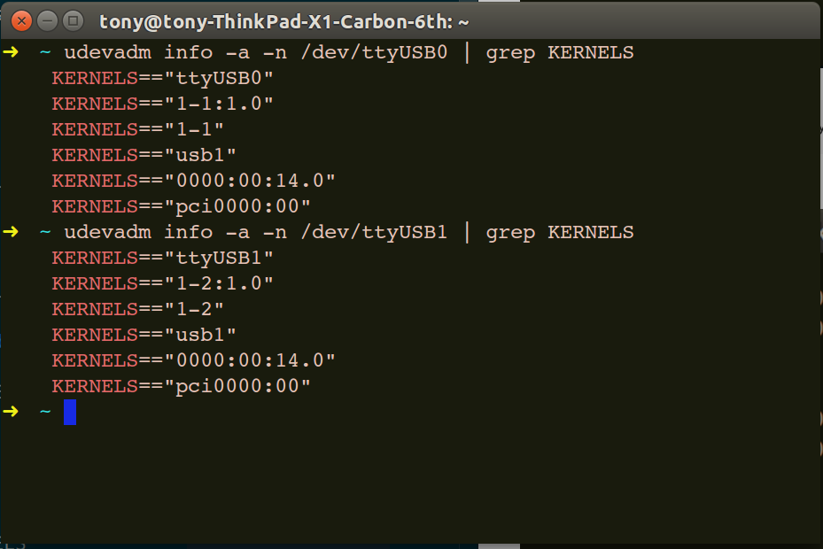

# How to create a udev rules

- [Introduction](#introduction)
- [Create The New UDEV Rules](#create-the-new-udev-rules)
    - [Create new udev file](#create-new-udev-file)
    - [Query serial port number through udevadm ](#query-serial-port-number-through-udevadm)
    - [Create UDEV Permission Rule For tty Devices](#create-udev-permission-rule-for-tty-devices)
- [Restart The UDEV Service](#restart-the-udev-service)


## Introduction
The serial port is used under Linux. The serial port number will change with the insertion order of multiple serial ports. This problem can be solved by setting the serial port alias.

## Create The New UDEV Rules
Create a new `ydlidar_ports.rules` file and write the corresponding serial port rules to the file.

### Create new udev file
```shell
sudo gedit /etc/udev/rules.d/ydlidar_ports.rules
```
or 
```shell
sudo vim /etc/udev/rules.d/ydlidar_ports.rules
```
### Query serial port number through udevadm 
```shell
udevadm info -a -n /dev/ttyUSB0 | grep KERNELS
```
result as follows:


```shell
udevadm info -a -n /dev/ttyUSB1 | grep KERNELS
```
result as follows:


### Create UDEV Permission Rule For tty Devices
Write the first KERNELS queried above into the new `ydlidar_ports.rules` file. Add these two following rules in it.
```ydlidar_ports.rules
SUBSYSTEM=="tty", KERNELS=="1-1:1.0", SYMLINK+="ydlidar", MODE="0666", GROUP:="dialout"
SUBSYSTEM=="tty", KERNELS=="1-2:1.0", SYMLINK+="ydlidar1", MODE="0666", GROUP:="dialout"
```

## Restart The UDEV Service
Save the file and close it. Then as root, tell systemd-udevd to reload the rules files (this also reloads other databases such as the kernel module index), by running.
```shell
sudo udevadm control --reload
```
and 
```shell
sudo service udev reload
sudo service udev restart
```
Note: If it doesn't work, plug and unplug the USB or restart the computer

### You can query the corresponding results with the following command
```shell
ls -l /dev/ydlidar*

lrwxrwxrwx 1 root dialout 7 Feb 17 13:27 /dev/ydlidar -> ttyUSB0
lrwxrwxrwx 1 root dialout 7 Feb 17 13:27 /dev/ydlidar1 -> ttyUSB1

```